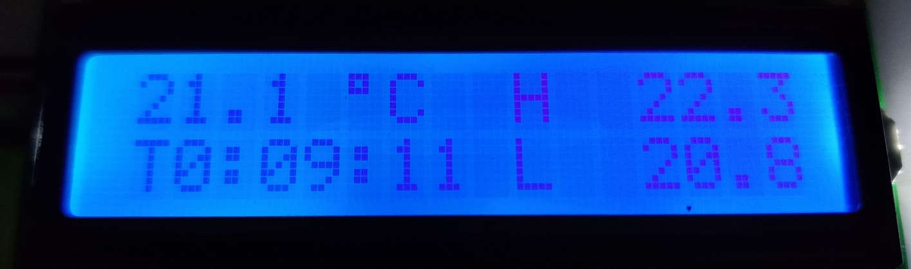
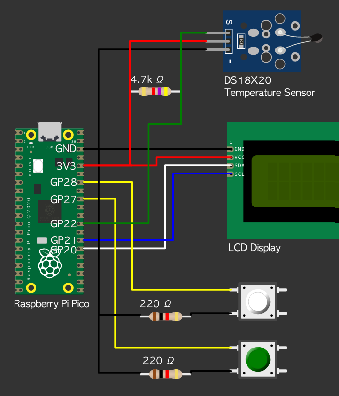

# Station for Measuring Temperature With LCD Display

The station is a Raspberry Pi Pico based project to display measured temperature with some optional extra features added. The scripts are written in MicroPython 1.17.

### Features
- Show the current temperature
- Show past min/max readings since start
- Reset the min/max readings with a button
- Turn on backlight for a few seconds with a button
- Recover from sensor disconnection and reconnection while executing the script

### Components

The picture below shows the assembled project.

List of components:

* Raspberry Pi Pico
* DS18X20 temperature sensor (waterproof version in the picture) + 4.7k Ω resistor
* *Optional*: 16x2 LCD display
* *Optional*: Button + 220 Ω resistor for resetting values
* *Optional*: Button + 220 Ω resistor for backlight

You will also need a bread board and some wires to set up the station as pictured.

The buttons are optional, the station works fine without them. If you leave out the backlight button you may want to set the variable `KEEP_BACKLIGHT_ON` to `True` in the `station.py` script.

The LCD display can be left out as well, in which case the script will print the readings to console instead.

The display below shows current temperature in Celsius, with record high (H) and low (L) since powering on, or the last reset (9 minutes and 11 seconds ago.)

The timer rolls over to zero after 10 hours.

### Wiring configuration

Diagram partially produced in [Wokwi](https://wokwi.com/).

Component | Lead/Pin | Pico
--|--|--
Reset Button
| | Leg 1 | GP28
| | Leg 2 | GND through 220 Ω resistor
Backlight Button
| | Leg 1 | GP27
| | Leg 2 | GND through 220 Ω resistor
DS18X20 temp. sensor
| | Data | GP22
| | GND | GND
| | VDD | 3V3(OUT)
LCD Display
| | SCL | GP21
| | SDA | GP20
| | GND | GND
| | VCC | 3V3(OUT)

DS18X20 sensor's Data and VCC leads need a 4.7k Ω resistor in between them.

## How to Run

Copy the `*.py` files to the root of the Pico. Then run `station.py`.

If you want make the project more portable, rename `station.py` to `main.py` and plug in a USB power bank into the Pico. The script will then run once the Pico is powered on. However, if you have problems reconnecting to the device after renaming the script, see (for example) here how to unbrick the device: https://forums.raspberrypi.com/viewtopic.php?f=146&t=305432

## Future Development

- Add wireless connectivity to collect readings to a database elsewhere
- Support multiple sensors
- Trigger a signal (flash backlight, display a message) when a targetted temperature is reached

# License

MIT License
